.. _activation-functions-label:

Overview of builtin activation functions
========================================

.. index:: ! activation function

Note that some of these :term:`functions <activation function>` are scaled differently from the canonical
versions you may be familiar with.  The intention of the scaling is to place more of the functions' "interesting"
behavior in the region :math:`\left[-1, 1\right] \times \left[-1, 1\right]`. Some of these are more intended for
:term:`CPPNs <CPPN>` (e.g., for :term:`HyperNEAT` - the :ref:`mexican_hat <mexican-hat-label>` function is specifically
intended for seeding HyperNEAT weight determination, for instance) than for "direct" problem-solving, as noted below;
however, even those originally meant mainly for CPPNs can be of use elsewhere - :ref:`abs <abs-label>` and
:ref:`hat <hat-label>` can both solve the :ref:`xor example <xor-example-label>` task in one generation, for instance (although
note for the former that it is included in several others such as :ref:`multiparam_relu <multiparam-relu-description-label>`).

The implementations of these functions can be found in the :py:mod:`activations` module.

The :term:`multiparameter` functions below, and some of the others, are new;
if you wish to try substituting them for previously-used activation functions,
the following are suggested as possibilities among the multiparameter functions:

.. csv-table::
    :widths: auto
    :header: Old, New, Notes
    :align: center

    abs, ":ref:`multiparam_relu <multiparam-relu-description-label>`, :ref:`multiparam_relu_softplus <multiparam-relu-softplus-label>`, or :ref:`weighted_lu <weighted-lu-label>`", "If the result does not need to be positive"
    abs, ":ref:`fourth_square_abs <fourth-square-abs-label>`", "If the result needs to be positive"
    clamped, ":ref:`clamped_tanh_step <clamped-tanh-step-label>` or :ref:`clamped_step <clamped-step-label>`"
    cube, ":ref:`multiparam_pow <multiparam-pow-label>`"
    gauss, ":ref:`hat_gauss_rectangular <hat-gauss-rectangular-label>` or :ref:`multiparam_gauss <multiparam-gauss-label>`", "Either is suitable for seeding a HyperNEAT-LEO CPPN"
    hat, ":ref:`hat_gauss_rectangular <hat-gauss-rectangular-label>`"
    identity, ":ref:`multiparam_relu <multiparam-relu-description-label>`, :ref:`multiparam_relu_softplus <multiparam-relu-softplus-label>`, :ref:`multiparam_pow <multiparam-pow-label>`, or :ref:`weighted_lu <weighted-lu-label>`"
    inv, ":ref:`multiparam_log_inv <multiparam-log-inv-label>`", "If for a CPPN"
    log, ":ref:`scaled_expanded_log <scaled-expanded-log-label>` or :ref:`multiparam_log_inv <multiparam-log-inv-label>`", "If for a CPPN"
    relu, ":ref:`multiparam_relu <multiparam-relu-description-label>`, :ref:`multiparam_relu_softplus <multiparam-relu-softplus-label>`, or :ref:`weighted_lu <weighted-lu-label>`", "If the result does not need to be positive"
    relu, ":ref:`multiparam_softplus <multiparam-softplus-label>`", "If the result needs to be positive"
    sigmoid, ":ref:`multiparam_sigmoid <multiparam-sigmoid-label>`"
    sin, ":ref:`wave <wave-label>`"
    softplus, ":ref:`multiparam_relu_softplus <multiparam-relu-softplus-label>`", "If the result does not need to be positive"
    softplus, ":ref:`multiparam_softplus <multiparam-softplus-label>`", "If the result needs to be positive"
    square, ":ref:`multiparam_pow <multiparam-pow-label>`", "If the result does not need to be positive"
    square, ":ref:`fourth_square_abs <fourth-square-abs-label>`", "If the result needs to be positive"
    tanh, ":ref:`clamped_tanh_step <clamped-tanh-step-label>`", "If the result needs to be within [-1, 1]"
    tanh, ":ref:`multiparam_tanh_log1p <multiparam-tanh-log1p-label>`", "If it does not need to be within [-1, 1]"

The builtin multiparameter functions are also present to serve as examples of how to construct and configure new such functions.

Two potentially-faster approximations of the :ref:`sigmoid <sigmoid-label>` and :ref:`tanh <tanh-label>` functions have also been added, namely :ref:`sigmoid_approx <sigmoid-approx-label>` and :ref:`tanh_approx <tanh-approx-label>`.

General-use activation functions (single-parameter)
-----------------------------------------------------------------------

clamped
^^^^^^^^^

.. figure:: activation-clamped.png
   :scale: 100 %
   :alt: clamped linear function

cube
^^^^

.. figure:: activation-cube.png
   :scale: 100 %
   :alt: cubic function

log1p
^^^^^^

.. figure:: activation-log1p.png
    :scale: 100 %
    :alt: log(x+1) function with alterations for negative numbers

relu
^^^^

.. figure:: activation-relu.png
   :scale: 100 %
   :alt: rectified linear function (max(x,0))

.. _sigmoid-label:

sigmoid
^^^^^^^

.. figure:: activation-sigmoid.png
   :scale: 100 %
   :alt: sigmoid function

sigmoid_approx
^^^^^^^^^^^^^^^

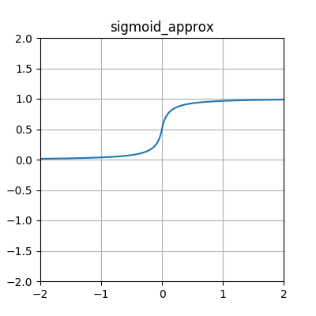

softplus
^^^^^^^^

.. figure:: activation-softplus.png
   :scale: 100 %
   :alt: soft-plus function (effectively a version of relu with a curve around 0)

step
^^^^

.. figure:: activation-step.png
    :scale: 100%
    :alt: step function: -1 below 0, 0 at exactly 0, 1 above 0

.. _tanh-label:

tanh
^^^^

.. figure:: activation-tanh.png
   :scale: 100 %
   :alt: hyperbolic tangent function

tanh_approx
^^^^^^^^^^^^

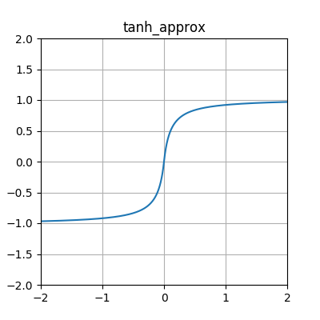

General-use activation functions (multiparameter)
---------------------------------------------------------------------

clamped_log1p_step
^^^^^^^^^^^^^^^^^^^

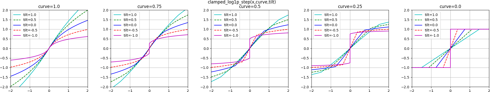

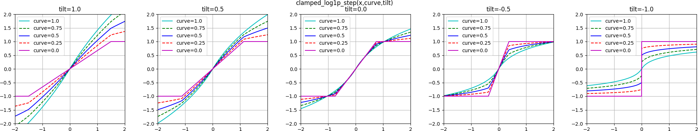

clamped_step
^^^^^^^^^^^^^

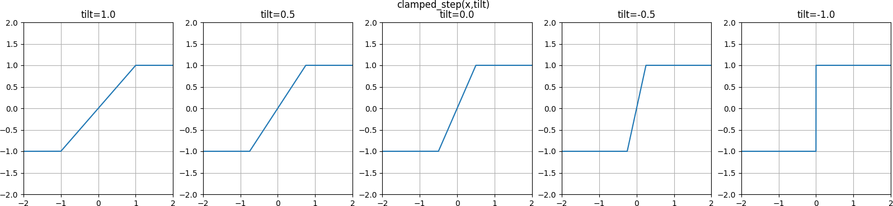

clamped_tanh_step
^^^^^^^^^^^^^^^^^^

.. figure:: activation-clamped_tanh_step.png
    :scale: 100 %
    :alt: Weighted combination of clamped, :ref:`tanh <tanh-label>`, and step functions.
    :name: clamped-tanh-step-label

multiparam_elu
^^^^^^^^^^^^^^^

.. figure:: activation-multiparam_elu.png
    :scale: 100 %
    :alt: Variable-scaling version of the exponential linear function (ELU)

.. figure:: activation-swap-multiparam_elu.png
    :scale: 100 %
    :alt: Variable-scaling version of the exponential linear function (ELU)

multiparam_pow
^^^^^^^^^^^^^^^^^^^^

.. figure:: activation-multiparam_pow.png
    :scale: 100 %
    :alt: Above a=1, pow(z, a); below 1, pow(z, pow(2,(a-1.0))
    :name: multiparam-pow-label

multiparam_relu
^^^^^^^^^^^^^^^

.. figure:: activation-multiparam_relu.png
    :scale: 100 %
    :alt: max(x, a*x), where a is an evolved parameter with a range from -1 to 1, inclusive. Acts like a weighted combination of abs, relu, and identity.
    :name: multiparam-relu-description-label

.. _multiparam-relu-softplus-label:

multiparam_relu_softplus
^^^^^^^^^^^^^^^^^^^^^^^^

.. figure:: activation-multiparam_relu_softplus.png
    :scale: 100 %
    :alt: A combination of multiparam_relu and multiparam_softplus.

.. figure:: activation-swap-multiparam_relu_softplus.png
    :scale: 100 %
    :alt: A combination of multiparam_relu and multiparam_softplus.

multiparam_sigmoid
^^^^^^^^^^^^^^^^^^^

.. figure:: activation-multiparam_sigmoid.png
    :scale: 100 %
    :alt: A version of :ref:`clamped_tanh_step <clamped-tanh-step-label>` rescaled to match :ref:`sigmoid <sigmoid-label>` instead of :ref:`tanh <tanh-label>`.
    :name: multiparam-sigmoid-label

multiparam_sigmoid_approx
^^^^^^^^^^^^^^^^^^^^^^^^^^^

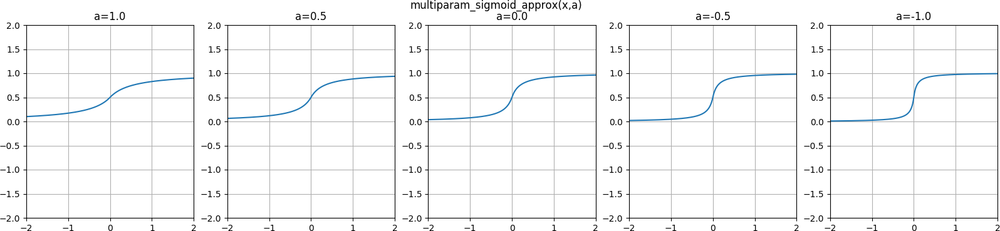

multiparam_softplus
^^^^^^^^^^^^^^^^^^^

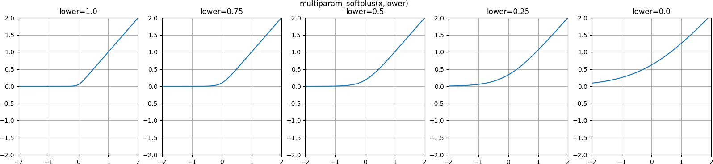

multiparam_tanh_approx
^^^^^^^^^^^^^^^^^^^^^^^

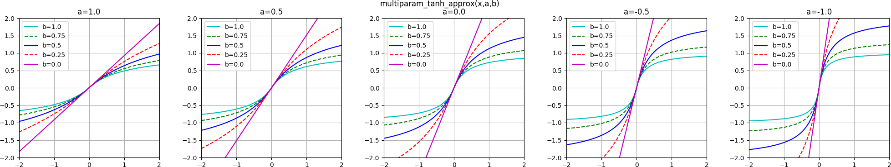

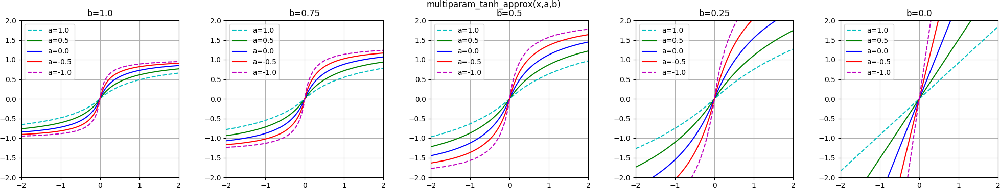

.. _multiparam-tanh-log1p-label:

multiparam_tanh_log1p
^^^^^^^^^^^^^^^^^^^^^

.. figure:: activation-multiparam_tanh_log1p.png
    :scale: 100 %
    :alt: A weighted combination of :ref:`clamped_tanh_step <clamped-tanh-step-label>` and scaled_log1p.

.. figure:: activation-swap-multiparam_tanh_log1p.png
    :scale: 100 %
    :alt: A weighted combination of :ref:`clamped_tanh_step <clamped-tanh-step-label>` and scaled_log1p.

scaled_log1p
^^^^^^^^^^^^^

.. figure:: activation-scaled_log1p.png
    :scale: 100 %
    :alt: A version of log1p with variable scaling (with partially-counterbalancing weights inside and outside the log1p function).

.. _weighted-lu-label:

weighted_lu
^^^^^^^^^^^^

.. figure:: activation-weighted_lu.png
    :scale: 100 %
    :alt: A weighted combination of multiparam_relu and multiparam_elu.

.. figure:: activation-swap-weighted_lu.png
    :scale: 100 %
    :alt: A weighted combination of multiparam_relu and multiparam_elu.

CPPN-intended activation functions (single-parameter)
----------------------------------------------------------------------------

abs
^^^

.. figure:: activation-abs.png
    :scale: 100 %
    :alt: absolute value function
    :name: abs-label

gauss
^^^^^

.. figure:: activation-gauss.png
   :scale: 100 %
   :alt: gaussian function

hat
^^^

.. figure:: activation-hat.png
    :scale: 100 %
    :alt: hat function
    :name: hat-label

identity
^^^^^^^^

.. figure:: activation-identity.png
    :scale: 100 %
    :alt: identity function
    :name: identity-label

rectangular
^^^^^^^^^^^

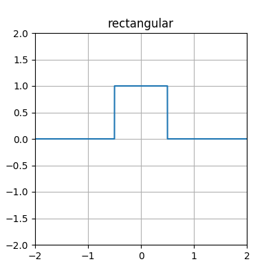

CPPN-intended activation functions (multiparameter)
---------------------------------------------------------------------------

.. _bicentral-label:

bicentral
^^^^^^^^^

This combination of two sigmoid functions is taken from the article "Taxonomy of neural transfer functions" [taxonomy]_, with adjustments.

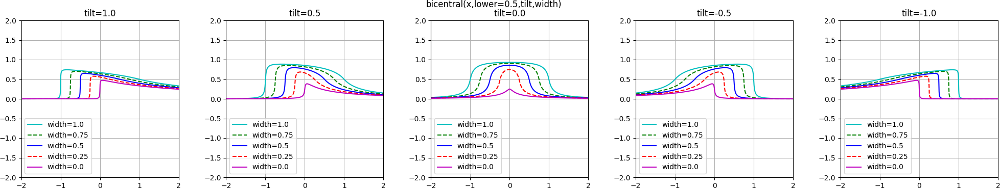

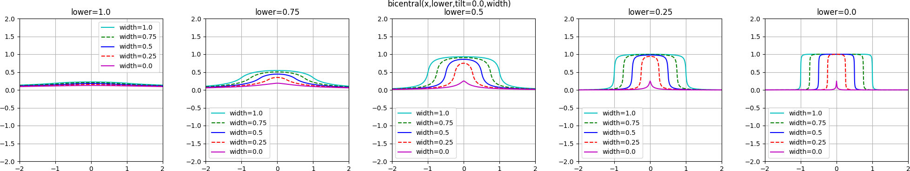

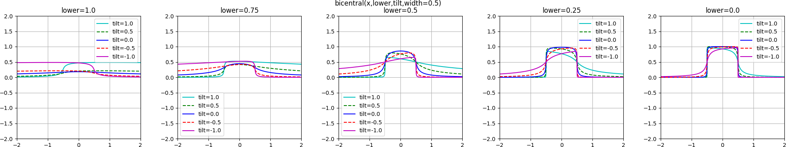

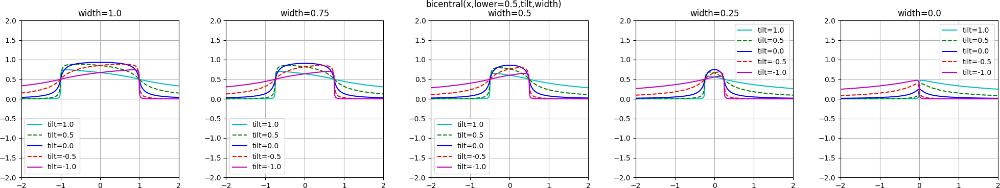

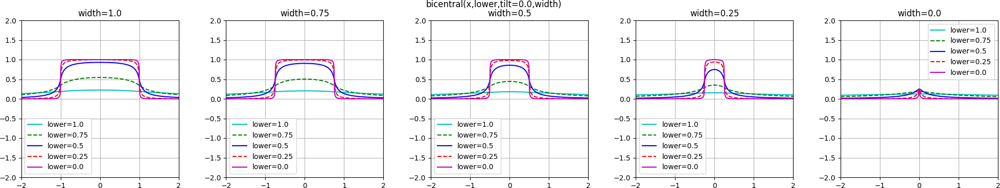

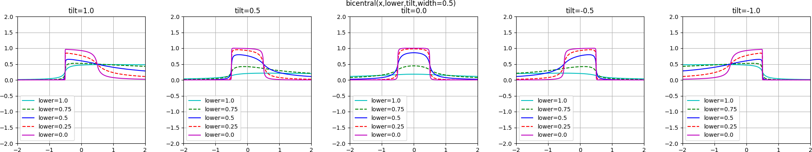

.. _hat-gauss-rectangular-label:

hat_gauss_rectangular
^^^^^^^^^^^^^^^^^^^^^

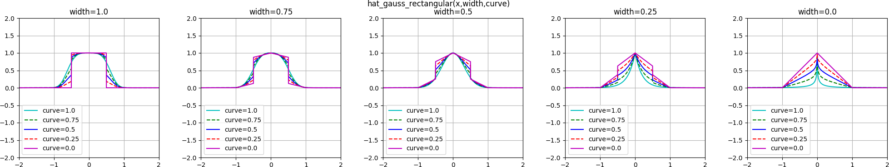

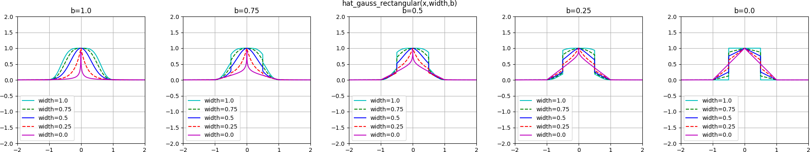

.. _multiparam-gauss-label:

multiparam_gauss
^^^^^^^^^^^^^^^^^^^^

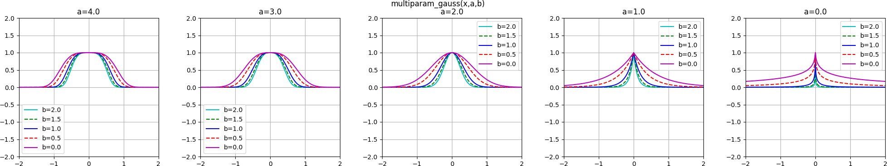

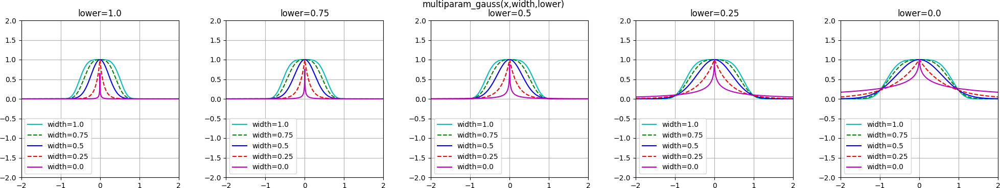

rational_quadratic
^^^^^^^^^^^^^^^^^^^

.. figure:: activation-rational_quadratic.png
    :scale: 100 %
    :alt: Rational quadratic kernel

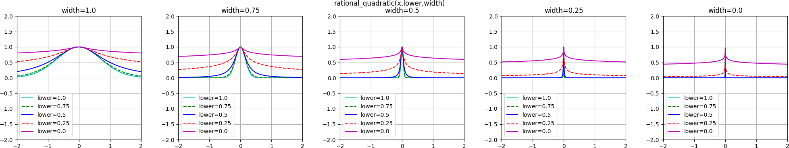

CPPN-use activation functions (single-parameter)
---------------------------------------------------------------------------

exp
^^^

.. figure:: activation-exp.png
   :scale: 100 %
   :alt: exponential function

expanded_log
^^^^^^^^^^^^^^

.. figure:: activation-expanded_log.png
    :scale: 100 %
    :alt: Expanded-range log function.

inv
^^^

.. figure:: activation-inv.png
   :scale: 100 %
   :alt: inverse (1/x) function

log
^^^

.. figure:: activation-log.png
   :scale: 100 %
   :alt: log function

sin
^^^

.. figure:: activation-sin.png
   :scale: 100 %
   :alt: sine function

skewed_log1p
^^^^^^^^^^^^

.. figure:: activation-skewed_log1p.png
    :scale: 100 %
    :alt: shifted log-plus function

square
^^^^^^

.. figure:: activation-square.png
   :scale: 100 %
   :alt: square function

square_wave
^^^^^^^^^^^^^

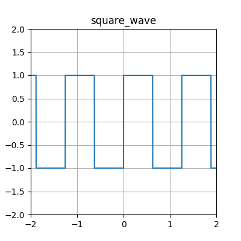

triangle_wave
^^^^^^^^^^^^^

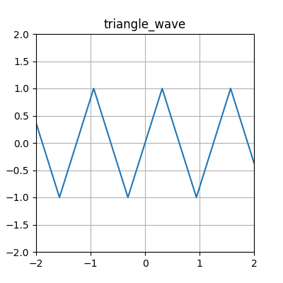

CPPN-use activation functions (multiparameter)
---------------------------------------------------------------------------

fourth_square_abs
^^^^^^^^^^^^^^^^^^

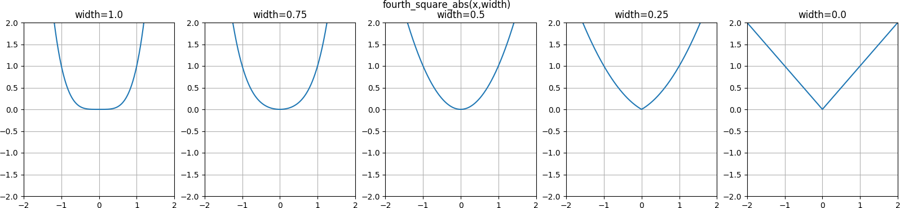

.. _mexican-hat-label:

mexican_hat
^^^^^^^^^^^^^^

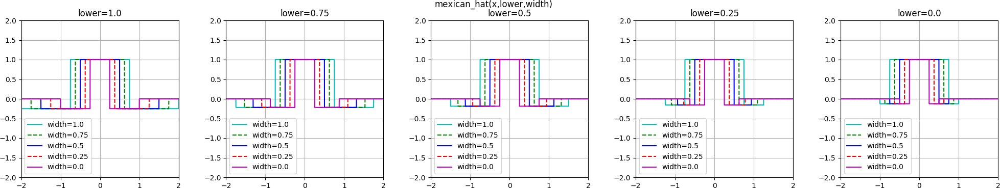

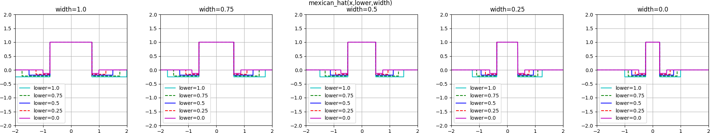

multiparam_log_inv
^^^^^^^^^^^^^^^^^^^^

.. figure:: activation-multiparam_log_inv.png
    :scale: 100 %
    :alt: Above 0.0, from scaled_expanded_log; below, weighted mean with inv of -1*x.
    :name: multiparam-log-inv-label

scaled_expanded_log
^^^^^^^^^^^^^^^^^^^^

.. figure:: activation-scaled_expanded_log.png
    :scale: 100 %
    :alt: A version of expanded_log with variable scaling (with partially-counterbalancing weights both inside and outside the expanded_log function).
    :name: scaled-expanded-log-label

wave
^^^^

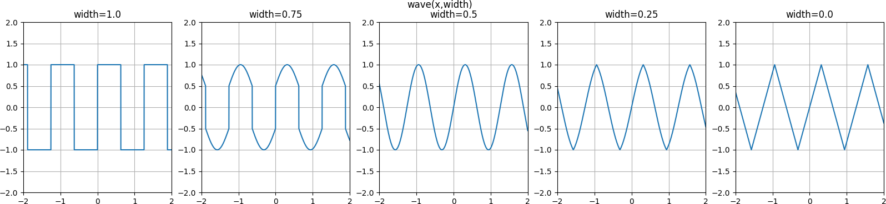

.. [taxonomy] Duch, Włodzisław; Jankowski, Norbert. 2000. Taxonomy of neural transfer functions. ICJNN 2000. `CiteSeerX Link <http://citeseerx.ist.psu.edu/viewdoc/summary?doi=10.1.1.29.9375>`_.