.. _activation-functions-label:

Overview of builtin activation functions
========================================

.. index:: ! activation function

Note that some of these :term:`functions <activation function>` are scaled differently from the canonical
versions you may be familiar with.  The intention of the scaling is to place
more of the functions' "interesting" behavior in the region :math:`\left[-1, 1\right] \times \left[-1, 1\right]`.
Some of these are more intended for :term:`CPPNs <CPPN>` (e.g., for :term:`HyperNEAT`) than for "direct" problem-solving,
as noted below; however, even those meant mainly for CPPNs can be of use elsewhere - `abs` and ``hat`` can both solve xor in one generation,
for instance (although note for the former that it is included in several others such as :ref:`multiparam_relu <multiparam-relu-description-label>`).

The :term:`multiparameter` functions below, and some of the others, are new; if users wish to try substituting them for previously-used activation functions, the following are suggested:

======== =======================================================
Old            New
======== =======================================================
abs             multiparam_relu, multiparam_relu_softplus, or weighted_lu
clamped      :ref:`clamped_tanh_step <clamped-tanh-step-label>`
cube           :ref:`multiparam_pow <multiparam-pow-label>`
gauss         :ref:`hat_gauss <hat-gauss-label>`
hat             :ref:`hat_gauss <hat-gauss-label>`
identity       multiparam_relu, multiparam_relu_softplus, or weighted_lu
inv             :ref:`multiparam_log_inv <multiparam-log-inv-label>`, if for a CPPN
log             :ref:`scaled_expanded_log <scaled-expanded-log-label>`, if for a CPPN
relu            multiparam_relu, multiparam_relu_softplus, or weighted_lu
sigmoid      :ref:`multiparam_sigmoid <multiparam-sigmoid-label>`
softplus      :ref:`multiparam_relu_softplus <multiparam-relu-softplus-label>`
square        :ref:`multiparam_pow <multiparam-pow-label>`
tanh           :ref:`clamped_tanh_step <clamped-tanh-step-label>`
======== =======================================================

The implementations of these functions can be found in the :py:mod:`activations` module.

General-use activation functions (single-parameter)
-----------------------------------------------------------------------

clamped
^^^^^^^^^

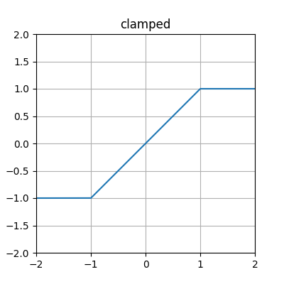

log1p
^^^^^^

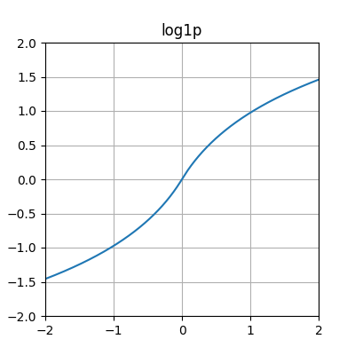

relu
^^^^

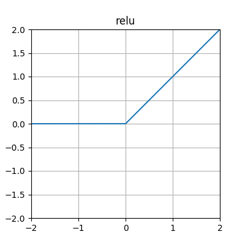

.. _sigmoid-label:

sigmoid
^^^^^^^

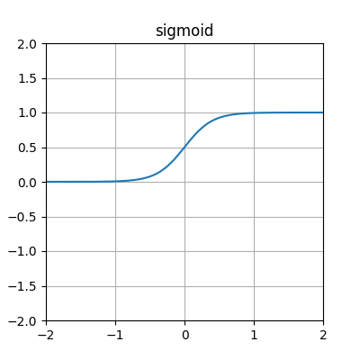

softplus
^^^^^^^^

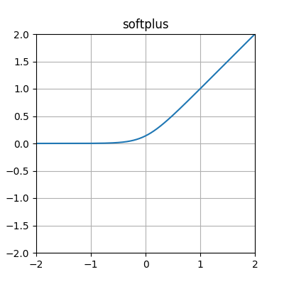

step
^^^^

.. figure:: activation-step.png
    :scale: 100%
    :alt: step function: -1 below 0, 0 at exactly 0, 1 above 0

.. _tanh-label:

tanh
^^^^

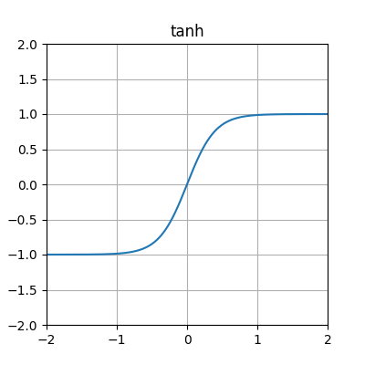

General-use activation functions (multiparameter)
---------------------------------------------------------------------

.. _clamped-tanh-step-label:

clamped_tanh_step
^^^^^^^^^^^^^^^^^^

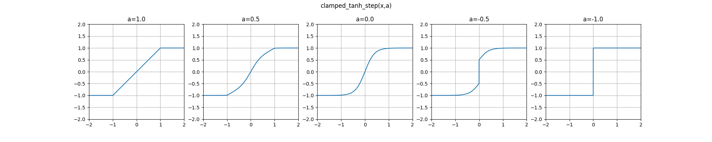

multiparam_elu
^^^^^^^^^^^^^^^

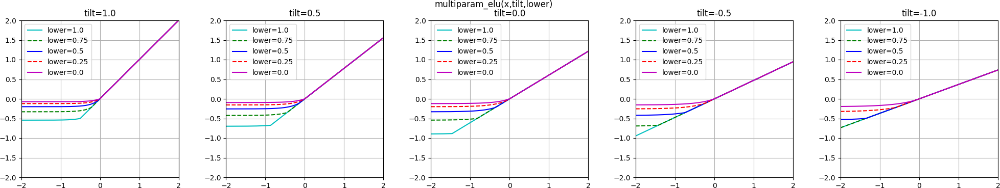

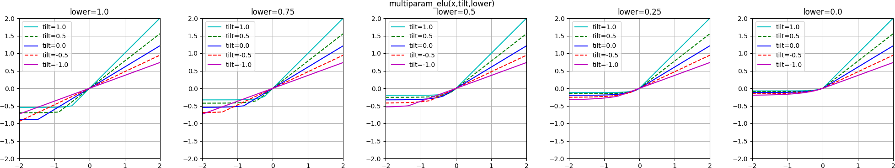

.. _multiparam-relu-description-label:

multiparam_relu
^^^^^^^^^^^^^^^

.. figure:: activation-multiparam_relu.png
    :scale: 100 %
    :alt: max(x, a*x), where a is an evolved parameter with a range from -1 to 1, inclusive. Acts like a weighted combination of abs, relu, and identity.

.. _multiparam-relu-softplus-label:

multiparam_relu_softplus
^^^^^^^^^^^^^^^^^^^^^^^^

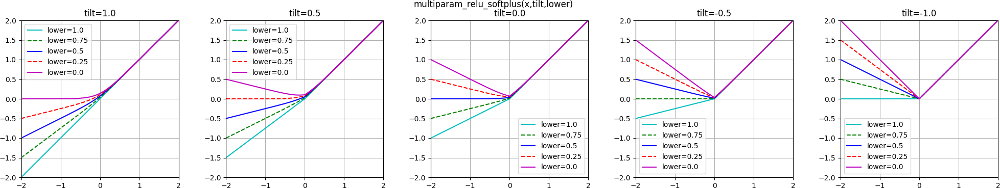

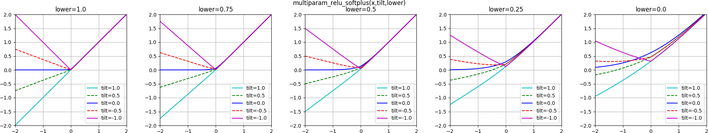

.. _multiparam-sigmoid-label:

multiparam_sigmoid
^^^^^^^^^^^^^^^^^^^

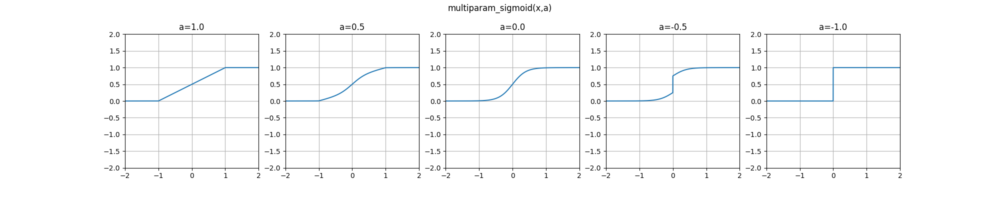

multiparam_tanh_log1p
^^^^^^^^^^^^^^^^^^^^^

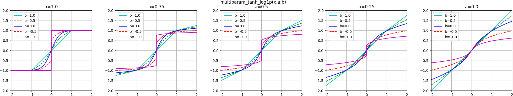

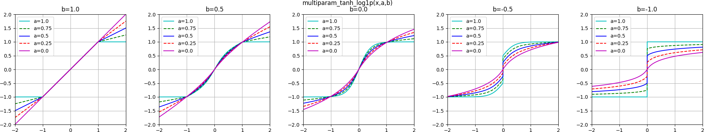

scaled_log1p
^^^^^^^^^^^^^

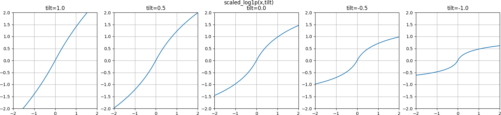

weighted_lu
^^^^^^^^^^^^

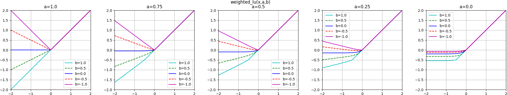

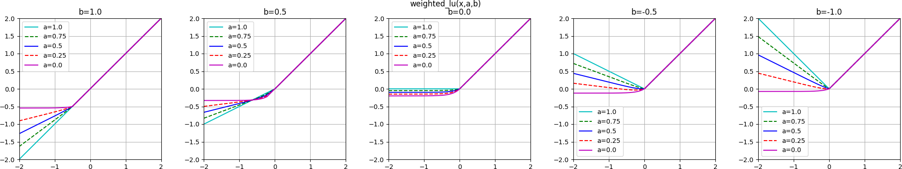

CPPN-intended activation functions (single-parameter)
----------------------------------------------------------------------------

abs
^^^

.. figure:: activation-abs.png
   :scale: 100 %
   :alt: absolute value function

cube
^^^^

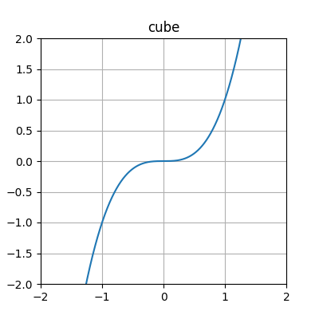

exp
^^^

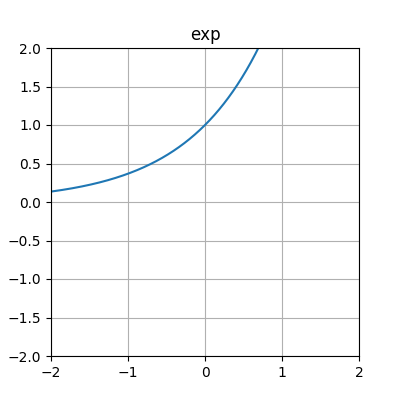

expanded_log
^^^^^^^^^^^^^^

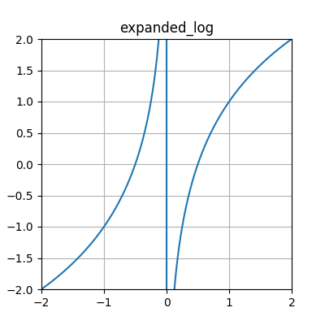

gauss
^^^^^

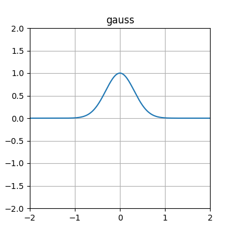

hat
^^^

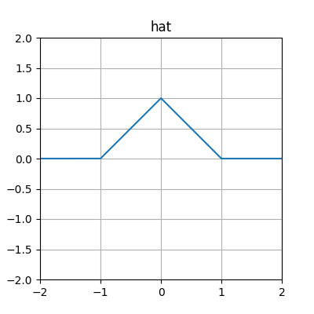

.. _identity-label:

identity
^^^^^^^^

.. figure:: activation-identity.png
   :scale: 100 %
   :alt: identity function

inv
^^^

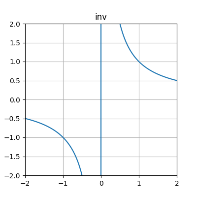

log
^^^

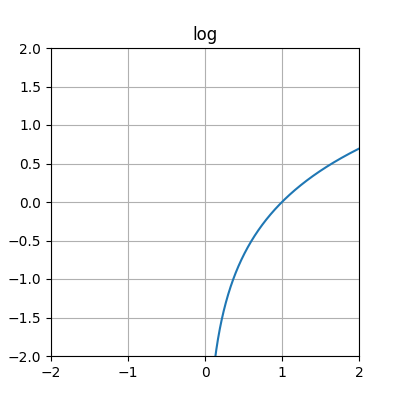

sin
^^^

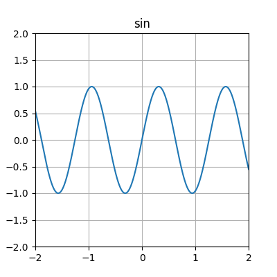

skewed_log1p
^^^^^^^^^^^^

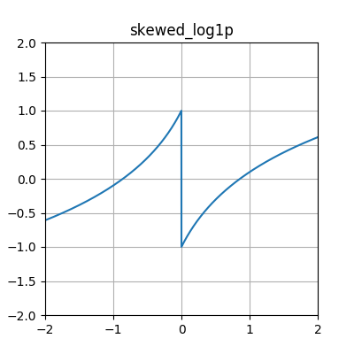

square
^^^^^^

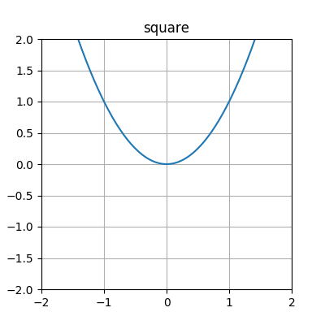

CPPN-intended activation functions (multi-parameter)
---------------------------------------------------------------------------

.. _hat-gauss-label:

hat_gauss
^^^^^^^^^^^

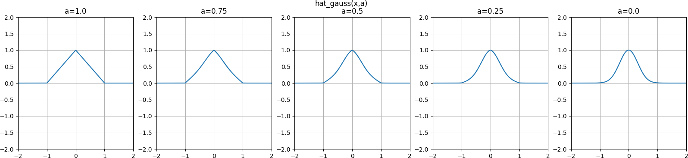

.. _scaled-expanded-log-label:

scaled_expanded_log
^^^^^^^^^^^^^^^^^^^^

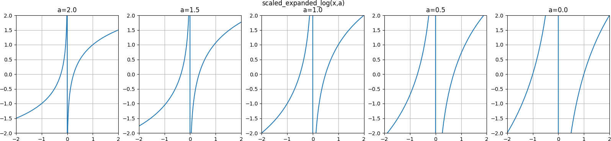

.. _multiparam-log-inv-label:

multiparam_log_inv
^^^^^^^^^^^^^^^^^^^^

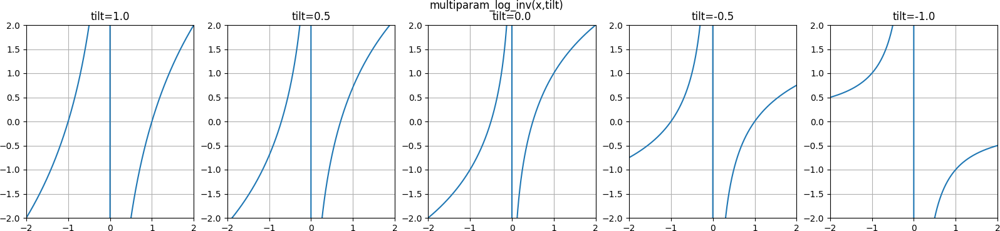

.. _multiparam-pow-label:

multiparam_pow
^^^^^^^^^^^^^^^^^^^^

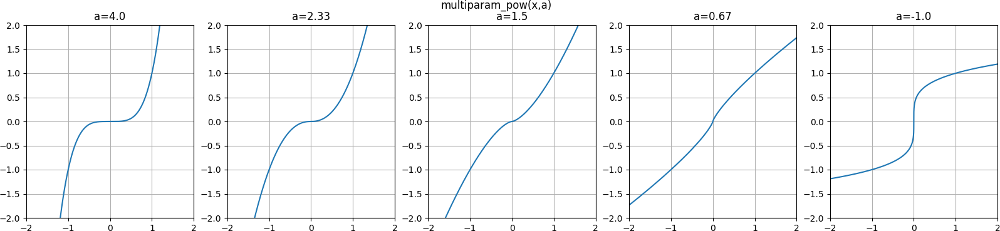
