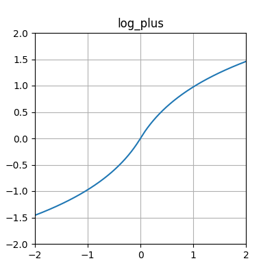
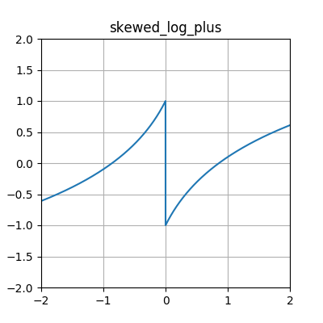

.. _activation-functions-label:

Overview of builtin activation functions
========================================

.. index:: ! activation function

Note that some of these :term:`functions <activation function>` are scaled differently from the canonical
versions you may be familiar with.  The intention of the scaling is to place
more of the functions' "interesting" behavior in the region :math:`\left[-1, 1\right] \times \left[-1, 1\right]`.
Some of these are more intended for CPPNs (e.g., for HyperNEAT) than for "direct" problem-solving;
these include expanded_log, sin, and skewed_log_plus.

The implementation of these functions can be found in the :py:mod:`activations` module.

abs
---

.. figure:: activation-abs.png
   :scale: 100 %
   :alt: absolute value function

clamped
-------

.. figure:: activation-clamped.png
   :scale: 100 %
   :alt: clamped linear function

.. _clamped-tanh-step-label:

clamped_tanh_step
---------------------------

.. figure:: activation-clamped_tanh_step.png
    :scale: 100 %
    :alt: Weighted combination of clamped, :ref:`tanh <tanh-label>`, and step functions.

cube
----

.. figure:: activation-cube.png
   :scale: 100 %
   :alt: cubic function

exp
---

.. figure:: activation-exp.png
   :scale: 100 %
   :alt: exponential function

expanded_log
-------------------

.. figure: activation-expanded_log.png
    :scale: 100 %
    :alt: Expanded-range log function.

gauss
-----

.. figure:: activation-gauss.png
   :scale: 100 %
   :alt: gaussian function

hat
---

.. figure:: activation-hat.png
   :scale: 100 %
   :alt: hat function

.. _identity-label:

identity
--------

.. figure:: activation-identity.png
   :scale: 100 %
   :alt: identity function

inv
---

.. figure:: activation-inv.png
   :scale: 100 %
   :alt: inverse function

log
---

.. figure:: activation-log.png
   :scale: 100 %
   :alt: log function

log_plus
-----------

.. _multiparam-relu-description-label:

multiparam_relu
----------------------

.. figure:: activation-multiparam_relu.png
    :scale: 100 %
    :alt: max(x, a*x), where a is an evolved parameter with a range from -1 to 1, inclusive.

.. _multiparam-sigmoid-label:

multiparam_sigmoid
----------------------------

.. figure:: activation-multiparam_sigmoid.png
    :scale: 100 %
    :alt: A version of :ref:`clamped_tanh_step <clamped-tanh-step-label>` rescaled to match :ref:`sigmoid <sigmoid-label>` instead of :ref:`tanh <tanh-label>`.

relu
----

.. figure:: activation-relu.png
   :scale: 100 %
   :alt: rectified linear function (max(x,0))

.. _sigmoid-label:

sigmoid
-------

.. figure:: activation-sigmoid.png
   :scale: 100 %
   :alt: sigmoid function

sin
---

.. figure:: activation-sin.png
   :scale: 100 %
   :alt: sine function

skewed_log_plus
------------------------

softplus
--------

.. figure:: activation-softplus.png
   :scale: 100 %
   :alt: soft-plus function (effectively a version of relu with a curve around 0)

square
------

.. figure:: activation-square.png
   :scale: 100 %
   :alt: square function

step
------

.. figure:: activation-step.png
    :scale: 100%
    :alt: step function: -1 below 0, 0.5 at exactly 0, 1 above 0

.. _tanh-label:

tanh
----

.. figure:: activation-tanh.png
   :scale: 100 %
   :alt: hyperbolic tangent function
